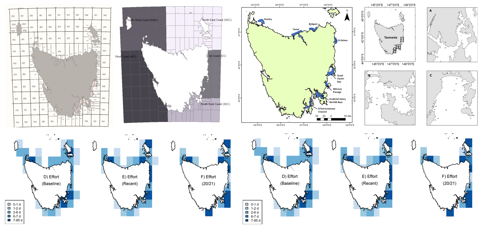
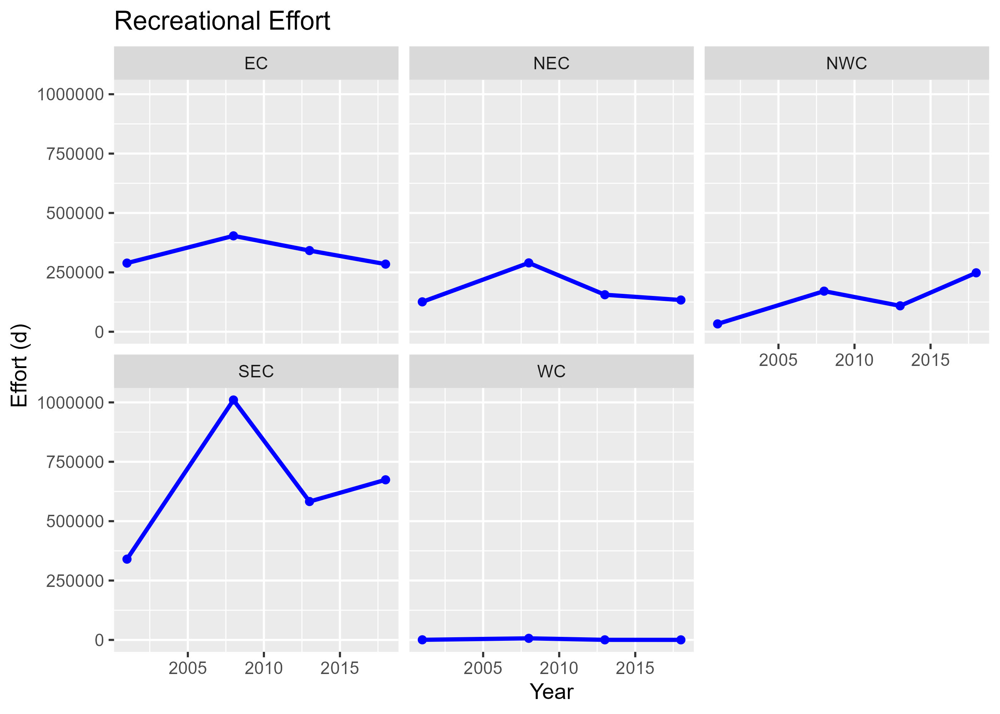
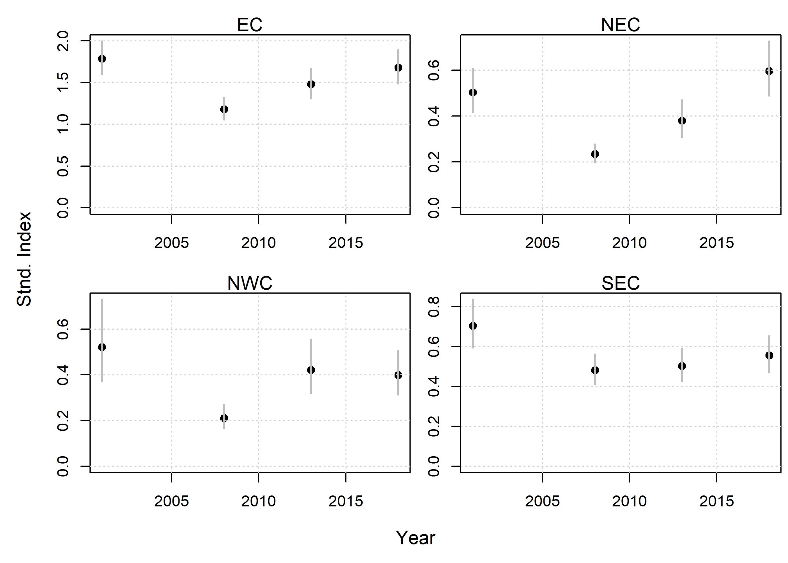
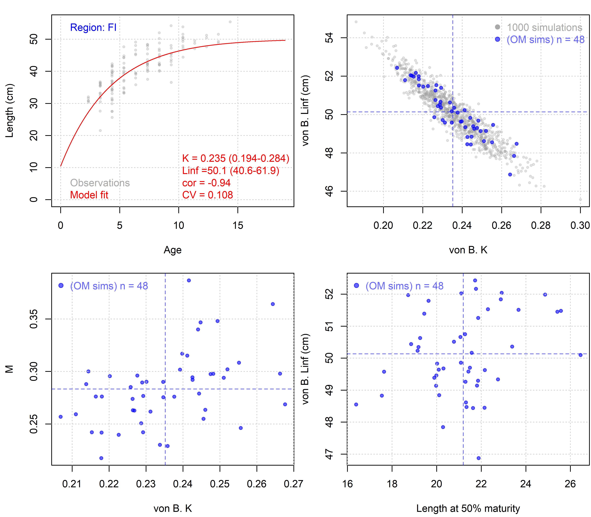

 


<style>
  .col2 {
    columns: 2 200px;         /* number of columns and width in pixels*/
    -webkit-columns: 2 200px; /* chrome, safari */
    -moz-columns: 2 200px;    /* firefox */
  }
  .col3 {
    columns: 3 100px;
    -webkit-columns: 3 100px;
    -moz-columns: 3 100px;
  }
  .col4 {
    columns: 4 100px;
    -webkit-columns: 4 100px;
    -moz-columns: 4 100px;
  }
</style>

***


***

&nbsp;


***

```{r setup, include=FALSE}
library(dplyr)
library(kableExtra)
library(readxl)

knitr::opts_chunk$set(echo = FALSE)


getprojectinfo<-function(page){
  tab=as.data.frame(read_excel("Project_Info/Project_Info.xlsx", sheet = page))
  #tab=tab[,2:3]
  tab[is.na(tab)]=""
  kable(tab,"simple")#,col.names=rep("",2)) 
}
  

getprog<-function(page){
  tab=as.data.frame(read_excel("Project_Info/Progress.xlsx", sheet = page))
  #tab=tab[,2:3]
  tab[is.na(tab)]=""
  kable(tab,"simple")#,col.names=rep("",2)) 
}
  


```


### Disclaimer

The following work is preliminary and intended only as tool for eliciting feedback on data, modelling and other aspects of these fisheries. 

None of these results are final. 

These analyses do not necessarily reflect the point of view of IMAS or other funders and in no way anticipate future policy in this area.

***

### Objective

Develop an MSE framework for the Tasmanian Sand Flathead fishery that can inform management decision making including research prioritization, assessment methodology, specification of fishing regulations and enforcement. 

***

### Project details

'Development of a draft operating model in openMSE for the assessment and management strategy evaluation of Southern Sand Flathead in Tasmania.'


```{r ProjDets, eval=T}
dat<-data.frame(c("Term","Funding body","Funding stream","Project No.","Project Partners","Blue Matter Team","IMAS Principal Investigators"),
                
                 c("15/03/2024 - 1/7/2024",
                   "University of Tasmania",
                   "Subcontract",
                   "T0030292",
                   "IMAS, Blue Matter Science Ltd.",
                   "Drs. Tom Carruthers & Adrian Hordyk",
                   "Dr. Sean Tracey"))

kable(dat,"simple",col.names=rep("",2)) 
 

```

***

&nbsp;

### Current Issues

Tabulated below are a list of current issues / assumptions that should be addressed at the current stage of framework development. 

```{r}
getprojectinfo("Issues")
```

***

&nbsp;


### Study Area




Figure 1. Study area. Area definitions (top left), areas of high recreational effort (top middle), areas of research focus (top right), commercial effort distribution (bottom left), commercial catch per unit effort (bottom right). 

&nbsp;


***


### Time Series Data

#### Recreational Fishery


Figure 2. Recreational catches by large region. 

&nbsp;




Figure 3. Recreational effort by large region. 

&nbsp;




Figure 4. Standardized Recreational CPUE indices by large region [log(CPUE) ~ Year + quarter + small_region + Method + Waterbody]. 

&nbsp;


#### Commercial Fishery


Figure 5. Commercial catch by large region.  

&nbsp;


Figure 6. Commercial effort by large region.  

&nbsp;


Figure 7. Commercial effort by large region.  

&nbsp;


#### Historial Composition Data


Figure 8. Aggregated historical length frequencies by large region.   

&nbsp;


Figure 9. Aggregated historical age frequencies by large region.   

&nbsp;


#### Fishery Independent Composition Data


Figure 10. Aggregated length frequencies from the fishery independent survey by large region.   

&nbsp;


Figure 11. Aggregated age frequencies from the fishery independent survey by large region.   

&nbsp;


***

&nbsp;


### Life history chracteristics

In order to include plausible uncertainty in the life-history dynamics for sand flathead, frequentist models of somatic growth and the length-weight relationship were fitted to data and parameter values draw from the variance covariance matrix arising from those fits (Figures 2 and 3)



Figure 2. Generation of stochastic life history parameters for a preliminary operating model for Flinders Island. Top left is the fit of a preliminary von Bertalanffy somatic growth model to observed age-length data.  Top right is the correlation among simulated asympotic length (Linf) and maximum growth rate (K) parameters drawn from the variance-covariance matrix of the model fit. Bottom left is the simualted natual mortality rate (M) given a fixed ratio of M/K and a lognormal error with CV of 10%. Bottom right is the simulated length at 50% maturity (L50) given a fixed ratio of L50/Linf and a lognormal error with CV of 10%. 


&nbsp;


Figure 3. Generation of stochastic weight-length parameters for a preliminary operating model for Flinders Island. Top left is the fit of a preliminary weight length (W=aL^b) growth model to observed length-weight data.  Top right is the correlation among the slope (a) and power (b) parameters drawn from the variance-covariance matrix of the model fit.

&nbsp;


The mean 'maturity' (fraction of individuals mature) ogive was calculated from the historical data (all regions combined, Figure 4a) and was the basis for simulating correlated uncertainty in L50 (length at 50% maturity) in Figure 2. A very different maturity ogive is provided by the more recent fishery independent survey (all regional combined, Figure 4b).


Figure 4a. The logistic relationship between length and fraction mature (fraction 'stage gonad development 3-7') of the historical data set. 

&nbsp;


Figure 4b. The logistic relationship between length and fraction mature (fraction 'stage gonad development' > 2) of the fishery independent survey data set. 


***


### Data Links


[Tasmanaian Wild Fisheries Assessments - Surveys - Age Data](https://tasfisheriesresearch.org/sfh/surveys/age-data/)

***

&nbsp; 

### Meta Data Links

[Meta data summary, Kruek, N.](Data_summaries/BMS_overview_data_and_contacts_flathead.xlsx)

***
&nbsp;


### Software and Code

[IMAS flathead GitHub repository (private) - requests for access go to Sean Tracey](https://github.com/bwwolfe/imas-flathead)

[openMSE (MSEtool, DLMtool, SAMtool R libraries)](https://openMSE.com)

[Rapid Conditioning Model (RCM) (Huynh 2023)](https://samtool.openmse.com/reference/RCM.html)


***

&nbsp;


### Recent Presentations

[Marshall, S. et al. 2022. Elevent years of fishery-independent monitory of Tasmanian sand flathead populations](Presentations/ASFB Nov 8th 2022.pptx)

[Krueck, N. 2023. Commercial logbook data for fishery assessments of Southern Sand Flathead](Presentations/BMS_commercial_flathead_data.pdf)

[Krueck, N. 2023. State-wide Rec Fishing Surveys TAS](Presentations/State-wide Rec Fishing Surveys TAS.pdf)

[Carruthers, T.R. May 2024. Deliverable 1: Straw Dog Operating models](Presentations/Deliverable 1 Straw Dog OM May 29th 2024.pdf)


***

&nbsp;

### Reports

[Coulson, P, et al. 2022. Fishery-independent monitoring of sand flathead popuation dynamics](Reports/IMASSandFlatheadIndepSurveys_2022.pdf)

[Krueck et al. 2023 Stock Assesssment](Reports/Sand_Flathead-Assessment_2023_FINAL.pdf)

[NRE. 2023. Sand Flathead in Tasmania WHAT’S HAPPENING WITH THE FISHERY?  Wild Fisheries Management Branch Department of Natural Resources and Environment Tasmania](https://fishing.tas.gov.au/Documents/Sand-Flathead-Whats%20Happening%20Paper-March23.pdf)

[Government of Tasmania. 2023. Flathead Rules Summary Oct 2023](Reports/Flathead-Rules-Summary-Oct-2023.pdf)

***

&nbsp;

### Research papers

[Hirst, Alastair & Rees, Christine & Hamer, Paul & Conron, Simon & Kemp, Jodie. 2014. The decline of sand flathead stocks in Port Phillip Bay: magnitude, causes and future prospects](Papers/RFGPResearchReport_SandFlathead_Final.pdf)

[Lyle, J.M., Brown, I.W., Moltschaniwskyj, N.A., Mayer, D., and Sawynok, W. 2006. National strategy for the survival of
released line caught fish: maximising post-release survival in line caught flathead taken in sheltered coastal waters.
FRDC Project No. 2004/071. Tasmanian Aquaculture and Fisheries Institute and Queensland Department of Primary
Industries and Fisheries](Papers/Lyle et al 2004-071-Tas-Flathead.pdf)


***

&nbsp;

### References

[IMAS. 2024. Recreational Fishing Research](https://www.imas.utas.edu.au/research/fisheries-and-aquaculture/fisheries/recreational-fishing-research#Rec-survey)

***

&nbsp;

### Acknowledgements

Sean Tracey, Nils Krueck, Kate Stark, Alyssa Marshall, Peter Coulson, Barrett Wolfe, Katie Cresswell, Ruth Sharples.

***

&nbsp;
&nbsp;


### Appendix 1: MSE terminology

### Operating models 

An operating model is a theoretical description of fishery and population dynamics used for the testing of management strategies that could include, for example,  data collection protocols, stock assessment methods, harvest control rules, enforcement policies and reference points. In fisheries, operating models are used in closed-loop simulation to test management procedures (aka. harvest strategy) accounting for feedbacks between the system, data, management procedure and implementation. A management procedure is any codifable rule that calculates management advice from data. Management Strategy Evaluation uses closed-loop simulation of management procedures as a core technical component but is a wider process of stakeholder and manager engagement that identifies system uncertainties, performance metrics, viable management procedures, ultimately aiming to adopt an MP for the provision of management advice for an established time period. 

&nbsp;

#### Reference Case Operating Models

The reference case operating model is used as the single 'base' operating model from which reference set and robustness set operating models are specified. Reference and robustness tests are typically 1-factor departures from the reference case OM, however sometimes reference set OMs are organized in a factorial grid across primary axes of uncertainty. 

&nbsp;

#### Reference Set Operating Models

Reference set operating models span a plausible range of the core uncertainties for states of nature. These are often the types of alternative parameterizations or assumptions that would be included in a stock assessment sensitivity analysis. 

The role of the reference set operating models is to provide the central basis for evaluating the performance of candidate management procedures, for example rejecting badly performing harvest strategies. 

&nbsp;

#### Robustness Set Operating Models

Robustness set operating models are intended to include additional sources of uncertainty for providing further discrimination among management procedures that perform comparably among reference set operating models. 

Robustness operating models often represent system states of nature that are not empirically informed or are hypotheses of a subset of stakeholders.

&nbsp;

***

&nbsp;&nbsp;&nbsp;&nbsp;&nbsp;&nbsp;&nbsp;&nbsp;&nbsp;&nbsp;&nbsp;&nbsp;

